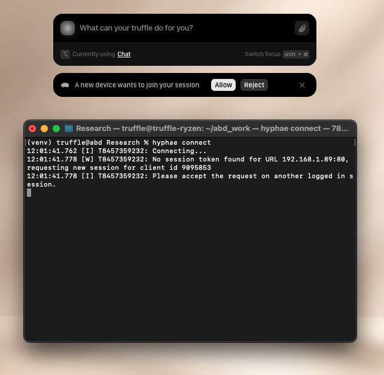

# Hyphae Setup Guide

Welcome to Hyphae

Please read [Get Started with Truffle](https://www.notion.so/Get-Started-With-Truffle-1feca50492ab80248afae3ce41896356?source=copy_link) before continuing with this tutorial.

## Prerequisites

## macOS Setup

### Install Python 3

If you don't have Python 3 installed on your Mac, follow [this comprehensive guide](https://docs.python-guide.org/starting/install3/osx/) to install Python 3 properly.

## Linux Setup

```bash
sudo apt update
sudo apt install -y python3 python3-pip
pip3 install hyphae
```

## Windows Setup

1. Download Python from: https://www.python.org/downloads/
2. Install Python following the installer instructions
3. Open Command Prompt or PowerShell and run:

```cmd
pip install hyphae
```
### Create Virtual Environment and Install Hyphae

Once you have Python 3 installed:

```bash
python3 -m venv myenv
source ./myenv/bin/activate
pip3 install hyphae
```


# Building Your First Hyphae App: ArXiv Research Assistant

## What You'll Learn

By the end of this tutorial, you'll understand:
- How Hyphae allows you to control your agent in creative ways
- What are tools, state, and predicates
- How to build, deploy, and test your own agentic applications

## What We'll Deploy Together

We'll explore an ArXiv Research Assistant that demonstrates most Hyphae concepts, to get you started with your own application:
- **Multi-source search**: ArXiv API, Semantic Scholar, web search
- **Stateful workflows**: Select papers and maintain context across conversations
- **Analysis by your Truffle agent**: Get expert insights on selected papers

---

## Part 1: Understanding the Code
Open [`example_apps/Arxiv/arxiv.py`](example_apps/Arxiv/arxiv.py) and follow along.

### The Basics: Imports and Setup

```python
import hyphae  # The main SDK
from hyphae.tools.respond_to_user import RespondToUserReturnType
from perplexity import PerplexitySearcher  # see perplexity.py
import hyphae.hooks as hooks
```

**Key Concept**: Hyphae apps are Python classes with decorated methods that become "tools" your Truffle agent can use.

### Agent State and Predicates

```python
class ArxivApp:
    def __init__(self):
        self.selected_paper = None    # Agent remembers selected paper
        self.paper_content = None     # Cached content
        
    def has_paper_selected(self) -> bool:
        """Predicate function - controls when tools are available"""
        return self.selected_paper is not None
```

**Key Concept**: Predicates control when tools are available, allowing you to have more control over your agents use of available tools.

### Tool Definitions

```python
@hyphae.tool("Search for papers on a specific topic", icon="magnifyingglass")
@hyphae.args(
    query="The search query (topic, keywords, or title)",
    max_results="Maximum number of results to return"
)
def SearchPapers(self, query: str, max_results: int = 10) -> str:
    # Tool implementation here...
```

**Key Concept**: 
- `@hyphae.tool()` makes a method available to your Truffle agent
- `@hyphae.args()` describes parameters so your agent knows how to use the tool
- Tools return strings that your agent can read and use

### Workflow Design: Search → Select → Analyze

Notice how the app creates a natural workflow:

1. **Search Tools** (always available):
   - `SearchPapers()` - ArXiv API search
   - `SearchWebPapers()` - Perplexity search
   - `SearchExternalPapers()` - Semantic Scholar search

2. **Selection Tool** (changes agent state):
   - `SelectPaper()` - Stores paper data in `self.selected_paper`

3. **Analysis Tools** (only available after selection):
   - `Researcher()` - expert agent on analyzing academic papers
   - `GetCurrentPaper()` - View selected paper info

```python
@hyphae.tool("Researcher - Discuss the selected paper", 
             predicate=lambda self: self.has_paper_selected())  # Only available when paper selected
```

**Key Concept**: Predicates create conditional tool access, guiding agents through specific workflows.

### External API Integration

The app shows three different integration patterns:

1. **REST API with XML/Atom** (ArXiv):
```python
def SearchPapers(self, query: str, max_results: int = 10) -> str:
    url = f"http://export.arxiv.org/api/query?search_query=all:{quote(query)}"
    response = requests.get(url)
    feed = feedparser.parse(response.content)  # Parse XML
    # Format results as markdown...
```

2. **REST API with JSON** (Semantic Scholar):
```python
def SearchExternalPapers(self, query: str, max_results: int = 10) -> str:
    url = "https://api.semanticscholar.org/graph/v1/paper/search"
    response = requests.get(url, params=params)
    data = response.json()  # Parse JSON
    # Format results...
```

3. **Using external models on the cloud** (Perplexity):
```python
def SearchWebPapers(self, query: str) -> str:
    search_query = f"academic papers research {query}"
    return PerplexitySearcher().run(search_query)  # Delegate to external model
```

See the [`AskForHelp` tool](example_apps/Code/code.py#L141-L156) in the Code app for another example of using other models for help:

You can do cool stuff like making an expert function that you can build context for on specific things you would like! 


```python
@hyphae.tool("Researcher - Discuss the selected paper with an expert")
def Researcher(self, question: str, analysis_type: str = "general") -> str:
    # Build rich context from selected paper
    paper_info = f"""
    Paper: {self.selected_paper['title']}
    Authors: {', '.join(self.selected_paper['authors'])}
    Abstract: {self.selected_paper['abstract']}
    """
    
    # Create expert prompt
    researcher_prompt = f"""You are an expert researcher. 
    User has selected this paper: {paper_info}
    
    Answer their question: {question}
    Focus on {analysis_type} analysis."""
    
    # Use external model for expert response
    return PerplexitySearcher().run(researcher_prompt)
```


For more detailed comments and the complete implementation, see [`example_apps/Arxiv/arxiv.py`](example_apps/Arxiv/arxiv.py).

---

## Part 2: Building and Deploying Your App

Now let's build and deploy this app so you can see it in action! Make sure you have [hyphae installed](#create-virtual-environment-and-install-hyphae) and the [TruffleOS client installed](https://www.notion.so/Get-Started-With-Truffle-1feca50492ab80248afae3ce41896356?source=copy_link) before proceeding.

### Step 1: Get the Code

```bash
git clone https://github.com/deepshard/get-started-with-hyphae.git
cd get-started-with-hyphae/example_apps/Arxiv
```

### Step 2: Understand the App Structure

Your app directory contains:

#### `app.json` - App Metadata
```json
{
    "app_uuid": "",
    "metadata": {
        "name": "Arxiv Research Assistant",
        "description": "Truffle agent for searching and analyzing academic papers",
        "icon": "arxiv.png"
    }
}
```

#### `Truffile` - Container Definition
```dockerfile
FROM hyphaehyphae/alpine-python:arm64
RUN pip3 install ddgs python-weather pytrends pandas requests feedparser 
COPY arxiv.py /opt/arxiv/arxiv.py
RUN pip3 install hyphae
WORKDIR /opt/arxiv
CMD ["python3", "/opt/arxiv/arxiv.py"]
```

#### `arxiv.py` - Your Agent Code
The Python file we just analyzed above.

#### `perplexity.py` - External Service Helper
Helper class for Perplexity Search integration.

### Step 3: Build Your App

```bash
# Build the app into a deployable bundle
hyphae build .
```

This creates a `.hyphae` bundle file containing your containerized app.

### Step 4: Deploy to TruffleOS

```bash
# Connect to your Truffle device
hyphae connect
```

Open your client and click accept. You are now connected. If it fails or the toast goes away, press `Ctrl+C` and try again.

<div align="center">
  
</div>

### Upload and Deploy Your App

```bash
hyphae upload .
```

<div align="center">
  
</div>

Your app will start uploading. Go to your client to see a progress indicator. Fresh app uploading takes some time to upload, but subsequent uploads will be faster since they are cached and only update your app.

---

## Part 3: Using Your App

Once deployed, users can interact with your ArXiv Research Assistant through the TruffleOS client.

## Part 4: Create Your Own App

Now that you understand how Hyphae works, let's create your own app! We recommend that you read through our [example apps](example_apps/) to get more context on more hyphae features.

### Step 1: Hyphae Create!

```bash
# Create your new app directory
hyphae create path-to-your-app
```

### Step 2: Customize Your App

Start building!

### Step 4: Build and Deploy

```bash
# Build your app
hyphae build .
```
```bash
hyphae build path-to-your-app
```

# Deploy to TruffleOS
```bash
# Build your app
hyphae upload .
```
```bash
hyphae upload path-to-your-app
```

## Support

Join our [Discord](https://discord.gg/itsalltruffles) for developer support!

## Developer Notes

We are working on making our CLI better and adding more sdk features.
Coming soon:
- Developer logs for you to better develop and debug your app
- Integration with our VSCode extension to make the process of building, testing, and deploying apps CLI free

Happy building!

