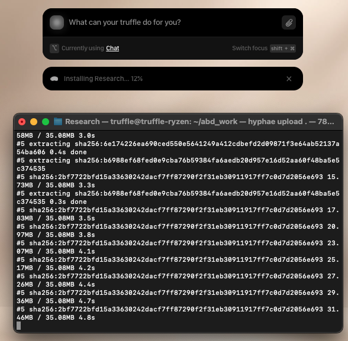

# Hyphae Setup Guide

Please read [Get Started with Truffle](https://www.notion.so/Get-Started-With-Truffle-1feca50492ab80248afae3ce41896356?source=copy_link) before continuing with this tutorial.

## macOS Setup

### Install Python 3

If you don't have Python 3 installed on your Mac, follow [this comprehensive guide](https://docs.python-guide.org/starting/install3/osx/) to install Python 3 properly.

### Create Virtual Environment and Install Hyphae

Once you have Python 3 installed:

```bash
python3 -m venv myenv
source ./myenv/bin/activate
pip3 install hyphae
```

## Linux Setup

```bash
sudo apt update
sudo apt install -y python3 python3-pip
pip3 install hyphae
```

## Windows Setup

1. Download Python from: https://www.python.org/downloads/
2. Install Python following the installer instructions
3. Open Command Prompt or PowerShell and run:

```cmd
pip install hyphae
```

## Getting Started

Follow [this tutorial here](GettingStarted/README.md) to make your app, join our [Discord](https://discord.gg/itsalltruffles) for more developer support!

## Building and Uploading your Hyphae App

Once you have developed your app, test that it's working and has no issues before building and uploading.

### Test Your App

```bash
python3 your-app-directory/main.py
```

If there are errors, fix them. Also make sure to have all your package requirements added to your Truffle file!

### Connect to Truffle

Connect Hyphae to your Truffle, having your client connected to your Truffle is a prerequisite for this:

```bash
hyphae connect
```
Open your client and click accept. You are now connected. If it fails or the toast goes away, press `Ctrl+C` and try again.

<div align="center">
  
</div>


### Build Your App

```bash
cd your-app-directory
hyphae build .
```
or

```bash
hyphae build your-app-dir
```

This will package your app to be uploaded to your Truffle.

### Upload Your App

```bash
cd your-app-directory
hyphae upload .
```
or

```bash
hyphae upload your-app-dir
```

<div align="center">
  
</div>

Your app will start uploading. Go to your client to see a progress indicator. Fresh app uploading takes some time to upload, but subsequent uploads will be faster since they are cached and only update your app.

## Support

Join our [Discord](https://discord.gg/itsalltruffles) for developer support!

## Developer Notes

We are working on making our cli better and adding more sdk features.
Things that are coming soon:
- Developer logs for you to better develop and debug your app
- hyphae init to make a template app for you saving you all the effort to copy the current template
- Nicer cli and better logs!